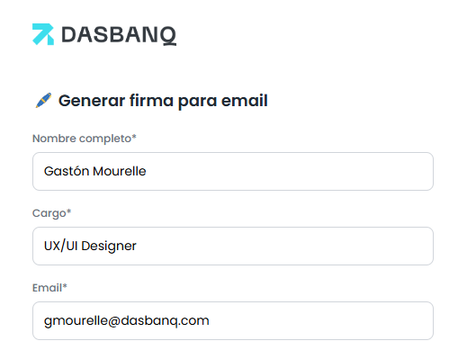
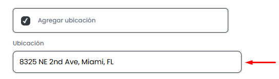
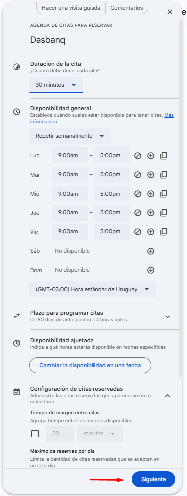
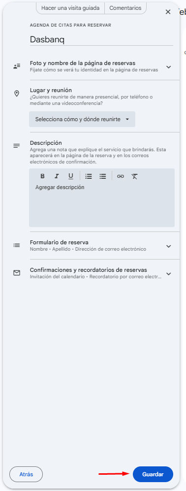
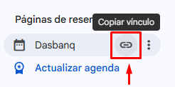
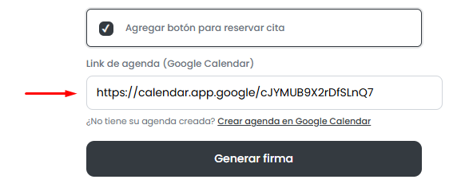
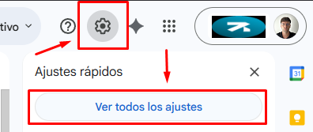
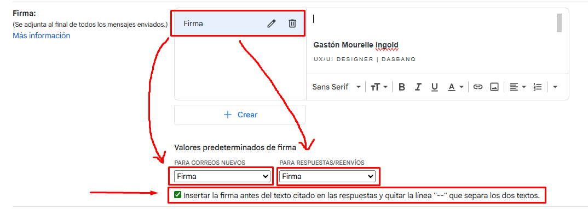

# 🖊️ Cómo configurar tu firma de email – Dasbanq

## 1️⃣ Abre el generador de firmas

**👉 https://gastonmourelle.github.io/firmas-email-dasbanq/**

## 2️⃣ Completa tus datos

- Nombre completo

- Tu cargo en Dasbanq

- Email (@dasbanq.com)

## 3️⃣ (Opcional) Agrega información extra

- Agregar ubicación:

*No es necesario poner ningún link. **La firma linkea a Maps** automáticamente a la dirección indicada.*

- Agregar botón para reservar cita

### Si no sabes como crear tu agenda de disponibilidad de Google Calendar:

**a.** Accede al link para crear la agenda: https://calendar.google.com/calendar/u/0/r/appointment

**b.** Establece tu disponibilidad y preferencias:

**c.** Click en **Siguiente**

**d.** Termina de completar los datos requeridos:

**e.** Click en **Guardar**

**f.** Click en el icono de **Copiar vínculo**:

**g.** Volver al link del generador de firmas de Dasbanq y pegar la url en "Link de agenda":

## 4️⃣ Genera y copia tu firma

- Click en **Generar firma**

>*Revisa que en la vista previa se muestre todo correctamente (textos, links):*

- Click en **Copiar firma**

## 5️⃣ Pega la firma en tu email

- Gmail

**a.** Ve a **Configuración → Ver toda la configuración**

**b.** Baja hasta **"Firma"** e introduce tu firma en el campo blanco *(unicamente clic derecho → pegar)*.

**c.** En los **"Valores predeterminados de firma"**, tiene que estar seleccionada la nueva firma para correos nuevos y para respuestas/reenvíos. *Nos aseguramos de esto comprobando que el nombre de la firma coincide con el que seleccionamos en ambos campos.*

**d.** Chequeamos la casilla de **"Insertar la firma antes del texto citado en las respuestas y quitar la línea "--" que separa los dos textos."**

**e.** Debería quedar así:

**f.** Baja hasta **Guardar cambios**

- Outlook: https://support.microsoft.com/es-es/office/crear-agregar-o-cambiar-una-firma-de-correo-electr%C3%B3nico-en-outlook-8ee5d4f4-68fd-464a-a1c1-0e1c80bb27f2

## ✅ Recomendaciones

>No modifiques la firma manualmente.

>Si necesitas cambiar algo, vuelve al generador y creala nuevamente.

>Si tienes más dudas contáctame: gmourelle@dasbanq.com